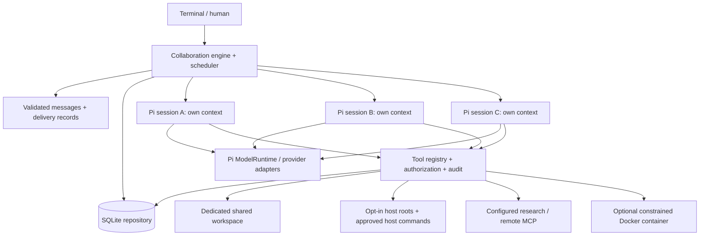

# Architecture

Roundtable is a single local Node.js process. SQLite owns shared committed state; each Pi AgentSession owns a separate conversation and JSONL lifecycle. The terminal is an adapter to the collaboration engine, not the engine itself. No server or coordinator agent is mandatory.

## Module boundaries

| Module | Responsibility |
| --- | --- |
| `domain.ts` | Runtime boundary schemas and shared records |
| `engine.ts` | Membership, scheduling, routing, budgets, human controls |
| `storage.ts` | SQLite migration, transactions and repository operations |
| `artifacts.ts` | ArtifactStore boundary and immutable SQLite artifact implementation |
| `pi-adapter.ts` | SDK session creation, tool translation, event subscription, cancellation |
| `providers.ts` | Pi catalog, supported auth, compatible endpoints, protocol admission probe |
| `tools.ts` | Tool registration, permission enforcement, core collaboration/workspace tools |
| `network-tools.ts` | Fixed research endpoint and allowlisted remote MCP adapter |
| `demo.ts` | Explicit deterministic provider fixture and independent artifact validator |
| `cli.ts` | Interactive terminal and noninteractive commands |

AgentAdapter, ProviderAdapter, ToolProvider, ToolExecutor, StorageAdapter, ArtifactStore, ApprovalProvider and CollaborationPolicy expose small contracts. The engine currently uses the concrete SQLite Repository for delivery/event operations. Alternative storage requires an expanded adapter; this is not a promised drop-in backend today. Agents share the model registry/auth runtime, not an LLM conversation. Credentials remain provider-scoped; independent aliases can be configured for different endpoints/accounts.

## Decisions and tradeoffs

- Embed verified Pi 1.1.0 APIs instead of forking Pi. Supply an explicit ResourceLoader, tool allowlist, custom tool definitions and session directory. Disable implicit context-resource discovery and cache warming. Native per-agent compaction and at most two transient agent retries use the same guarded, metered stream; transport retries are disabled to avoid unmetered repeats. Original Pi history stays durable after compaction.
- Node 24 includes SQLite; this avoids a platform-specific database addon. SQL entities use typed JSON records with indexed ownership, while messages/events retain append order.
- One scheduler job per agent prevents simultaneous mutation of its context. Different agents run concurrently, bounded by the session limit. Sending queues durable delivery and returns immediately.
- Messages require explicit tools to reach peers. Assistant prose goes to the human transcript. This prevents every generated paragraph from causing recursive broadcast.
- Retrieval tools fetch selected threads and notes. Shared history is not injected wholesale into every agent.
- Session policies carry objective, mode and constraints to each agent. Open, goal, structured and parallel modes currently share the same bounded scheduler. Structured constraints are instructions; no enforced multi-stage workflow DSL exists yet.
- The terminal uses Node's readline interface; finished messages are clearly labeled. SDK text-delta events are exposed by Engine for future UI adapters, but the current terminal displays completed messages rather than live partial tokens.

## Usability integration boundaries

`session-lock.ts` claims a session before recovery using SQLite transactions and host/PID ownership. Direct host edits use the same claim mechanism keyed by canonical file path. These coordinate upgraded processes sharing one database; they are not distributed leases or protection against external editors.

`jobs.ts` owns approved child processes and durable job records. `completion.ts` derives idle/waiting/running state from tasks, approvals, deliveries and jobs, without treating idle as validated success. `usage.ts` separates available token components from SDK cost estimates. `setup.ts` writes explicit provider/access configuration; `knowledge.ts` stores human-curated, expiring project memory; `workflows.ts` validates non-executable recipes. `releases.ts` switches among already-installed Windows copies after checking the target. Headless CLI events use the same engine, excluding partial text fragments and implicit host grants.

## SDK verification

On 2026-10-08, npm reported `@earendil-works/pi-coding-agent@1.1.0`, requiring Node >=22.19. Inspected the installed declarations and official SDK examples `05-tools.ts`, `09-api-keys-and-oauth.ts`, `11-sessions.ts` and `12-full-control.ts`. Verified `createAgentSession`, `customTools`, `ToolDefinition.execute`, `ModelRuntime`, `SessionManager.continueRecent`, `ResourceLoader`, `SettingsManager.inMemory`, `Agent.streamFunction`, subscription and abort/dispose behavior through compilation and tests.

Official references: [repository](https://github.com/earendil-works/pi), [SDK](https://pi.dev/docs/latest/sdk), [extensions](https://pi.dev/docs/latest/extensions), [models](https://pi.dev/docs/latest/models), [providers](https://pi.dev/docs/latest/providers), [MCP](https://pi.dev/docs/latest/mcp), [Windows](https://pi.dev/docs/latest/windows). Documentation under `latest` can change; installed declarations and package-lock.json define this release's integration.
