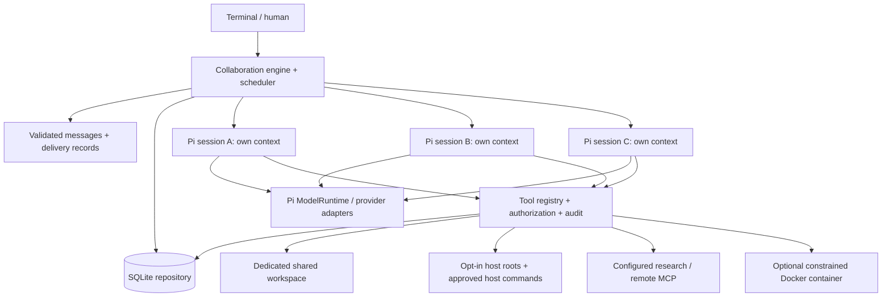

# Architecture

Roundtable is a single local Node.js process. SQLite owns shared committed state; each Pi AgentSession owns a separate conversation and JSONL lifecycle. The terminal is an adapter to the collaboration engine, not the engine itself. No server or coordinator agent is mandatory.

## Module boundaries

| Module | Responsibility |
| --- | --- |
| `domain.ts` | Runtime boundary schemas and shared records |
| `engine.ts` | Membership, scheduling, routing, budgets, human controls |
| `storage.ts` | SQLite migration, transactions and repository operations |
| `artifacts.ts` | ArtifactStore boundary and immutable SQLite artifact implementation |
| `pi-adapter.ts` | SDK session creation, tool translation, event subscription, cancellation |
| `providers.ts` | Pi catalog, supported auth, compatible endpoints, protocol admission probe |
| `tools.ts` | Tool registration, permission enforcement, core collaboration/workspace tools |
| `network-tools.ts` | Fixed research endpoint and allowlisted remote MCP adapter |
| `demo.ts` | Explicit deterministic provider fixture and independent artifact validator |
| `cli.ts` | Interactive terminal and noninteractive commands |

AgentAdapter, ProviderAdapter, ToolProvider, ToolExecutor, StorageAdapter, ArtifactStore, ApprovalProvider and CollaborationPolicy expose small contracts. The engine currently uses the concrete SQLite Repository for delivery/event operations. Alternative storage requires an expanded adapter; this is not a promised drop-in backend today. Agents share the model registry/auth runtime, not an LLM conversation. Credentials remain provider-scoped; independent aliases can be configured for different endpoints/accounts.

## Decisions and tradeoffs

- Embed verified Pi 1.1.0 APIs instead of forking Pi. Supply an explicit ResourceLoader, tool allowlist, custom tool definitions and session directory. Disable implicit context-resource discovery and cache warming. Native per-agent compaction and at most two transient agent retries use the same guarded, metered stream; transport retries are disabled to avoid unmetered repeats. Original Pi history stays durable after compaction.
- Node 24 includes SQLite; this avoids a platform-specific database addon. SQL entities use typed JSON records with indexed ownership, while messages/events retain append order.
- One scheduler job per agent prevents simultaneous mutation of its context. Different agents run concurrently, bounded by the session limit. Sending queues durable delivery and returns immediately.
- Messages require explicit tools to reach peers. Assistant prose goes to the human transcript. This prevents every generated paragraph from causing recursive broadcast.
- Retrieval tools fetch selected threads and notes. Shared history is not injected wholesale into every agent.
- Session policies carry objective, mode and constraints to each agent. Open, goal, structured and parallel modes currently share the same bounded scheduler. Structured constraints are instructions; no enforced multi-stage workflow DSL exists yet.
- Interactive terminals use Ink/React; noninteractive inputs keep the readline/plain path. SDK deltas update a bounded live preview and completed messages enter terminal scrollback.

## Usability integration boundaries

`session-lock.ts` claims a session before recovery using SQLite transactions and host/PID ownership. Direct host edits use the same claim mechanism keyed by canonical file path. These coordinate upgraded processes sharing one database; they are not distributed leases or protection against external editors.

`jobs.ts` owns approved child processes and durable job records. `completion.ts` derives idle/waiting/running state from tasks, approvals, deliveries and jobs, without treating idle as validated success. `usage.ts` separates available token components from SDK cost estimates. `setup.ts` writes explicit provider/access configuration; `knowledge.ts` stores human-curated, expiring project memory; `workflows.ts` validates non-executable recipes. `releases.ts` switches among already-installed Windows copies after checking the target. Headless CLI events use the same engine, excluding partial text fragments and implicit host grants.

## SDK verification

On 2026-10-08, npm reported `@earendil-works/pi-coding-agent@1.1.0`, requiring Node >=22.19. Inspected the installed declarations and official SDK examples `05-tools.ts`, `09-api-keys-and-oauth.ts`, `11-sessions.ts` and `12-full-control.ts`. Verified `createAgentSession`, `customTools`, `ToolDefinition.execute`, `ModelRuntime`, `SessionManager.continueRecent`, `ResourceLoader`, `SettingsManager.inMemory`, `Agent.streamFunction`, subscription and abort/dispose behavior through compilation and tests.

Official references: [repository](https://github.com/earendil-works/pi), [SDK](https://pi.dev/docs/latest/sdk), [extensions](https://pi.dev/docs/latest/extensions), [models](https://pi.dev/docs/latest/models), [providers](https://pi.dev/docs/latest/providers), [MCP](https://pi.dev/docs/latest/mcp), [Windows](https://pi.dev/docs/latest/windows). Documentation under `latest` can change; installed declarations and package-lock.json define this release's integration.

## Settings and integrations boundaries

input.ts owns the readline stream for chat, menus and masked auth prompts. settings.ts separates saved new-session limits from persisted session records. auth-ui.ts uses the installed registry and supported Pi login interface; browser launching receives HTTPS URLs as arguments without shell interpolation. Engine.changeModel validates a replacement before disposing the prior adapter, keeping the same session directory and participant ID.

skills.ts uses Pi frontmatter parsing to store only reviewed instruction snapshots. connections.ts uses Pi MCP HTTP and stdio transports for explicitly configured servers. Tool-call fingerprints include current connection/skill configuration so cached results cannot bypass revocation. Connection lifecycle is per operation; native Pi automatic resource/extension discovery remains disabled.

### Recovery and stage boundaries

`policy.ts` enforces explicit stage barriers; free collaboration remains available. `attachments.ts` handles human-selected immutable input snapshots and per-recipient checks. `views.ts` formats common terminal views. Prepared/committed tool operations, durable owner notifications and guarded file checkpoints belong to the runtime/repository boundary. A failed or uncertain effect is distinct from an idle scheduler and from human acceptance.

The complete audit is tracked in IMPLEMENTATION_CHECKLIST.md. A general stage graph, isolated executable extension host, document pipeline and persistent integration pool remain future implementation work; the current modules do not imply those capabilities exist.

### Project portability and composer (dev.6)

`session-bundles.ts` owns portable snapshot validation, ID remapping and staged import; it does not own credentials or resume execution. `projects.ts` stores human-reviewed instruction snapshots and folder-scoped defaults independently from agent histories. `composer.ts` resolves explicit file mentions and runs human-selected editors; `input.ts` suspends its input ownership during editing. Queue ranking lives in the repository, distinct from message sequence. Provider endpoint lifecycle remains behind `ProviderRegistry`; terminal edits disconnect affected adapters before changing their destination. These changes introduce no new dependencies.

## Presentation boundary (dev.8)

`src/ui/terminal.tsx` adapts CLI/engine activity into `PresentationController`. The controller owns display snapshots, input editing, dialog promises and input events only. `RoundtableApp`, `MessageEntry`, `PromptComposer` and `StatusLine` render these snapshots. Components never access repositories, providers or execution permissions. Existing CLI handlers remain the command/action boundary. A future desktop frontend can consume the same engine events and replace this presentation adapter without importing Ink.

Theme tokens are in `src/ui/theme.ts`; the terminal owns its background/font. Stable agent IDs key concurrent live activity. Ink Static commits final messages to scrollback; frame rate is capped at 20 FPS. Redaction and terminal-control sanitization apply before presentation. Secret answers are held outside public snapshots, masked and omitted from history. Exact approval commands are wrapped, not shortened.

`documents.ts` invokes a disposable resource-limited worker for PDF/Office extraction; originals and extracted-text checksums are retained in attachments. Binary artifacts preserve bytes separately from text encoding. `ConnectionPool` keeps bounded, independent per-agent MCP sessions, expires idle clients and never replays failed tool invocations. Shared runtime state and each Pi conversation remain independent of the renderer.

## Sprint 2 boundaries

The Ink Markdown renderer and reusable validated composer remain presentation-only. research.ts owns bounded network adapters and source caching; Repository migration 3 maintains FTS5 indexes transactionally through triggers. mcp-auth.ts embeds Pi OAuth, with a private per-endpoint store and shared refresh adapter; connections.ts retains independent participant transports. Skills captures immutable file manifests; execution remains an explicit Sprint 1 sandbox operation, never an in-process plugin import. policy.ts validates prerequisite graphs and deterministic acceptance rules. evaluation.ts reads recorded evidence without starting agents. See SPRINT_2.md for bounds.
